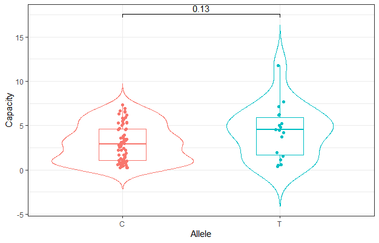
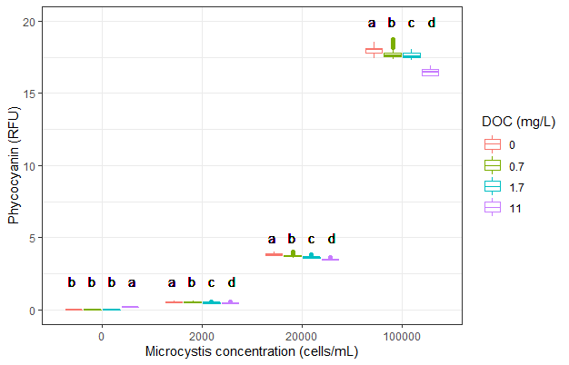

## ggpubr

ggpubr: ‘ggplot2’ Based Publication Ready Plots. Find out more at https://rpkgs.datanovia.com/ggpubr.

[R Script](./script/violin.R.txt)

## PerformanceAnalytics:chart.Correlation 画相关性，改变标签字体大小

[R script](./script/chart.Correlation.R.txt)

## 分组箱型图

[R script](./script/multiple-boxplot.R.txt)
